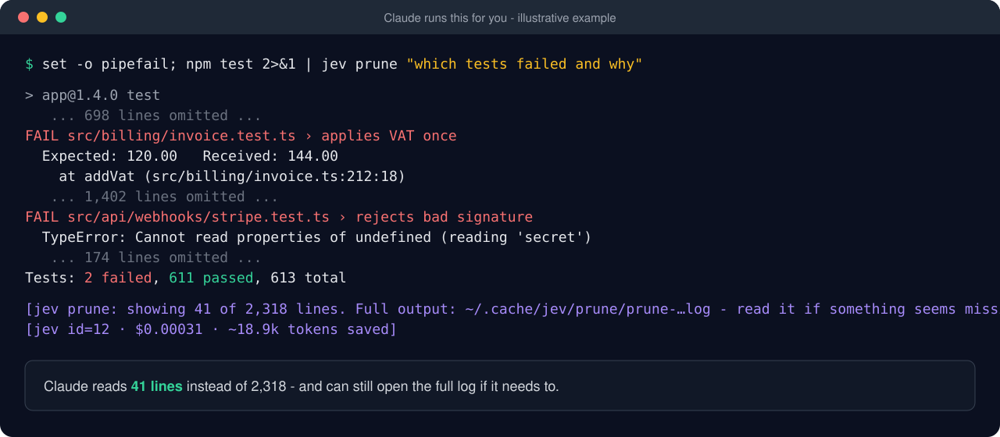
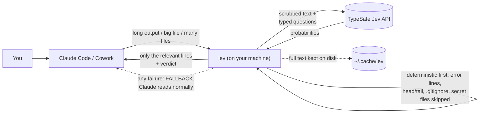

<p align="center">
  
</p>

<p align="center">
  <a href="https://github.com/Dinesh-Sunny/jev-tokensaver/actions/workflows/ci.yml"></a>
  <a href="https://github.com/Dinesh-Sunny/jev-tokensaver/releases"></a>
  <a href="LICENSE"></a>
  
  
  
</p>

# jev-tokensaver

**Cut Claude Code and Cowork token use.** Let [TypeSafe's Jev](https://docs.typesafe.ai) read the long stuff (test logs, huge files, dozens of candidate files) and show Claude only the parts that matter.
Lossless, fail-open, and your secrets never leave your machine.

[Quickstart](#quickstart) · [What it does](#what-it-does) · [How it works](#how-it-works) · [Safety](#safety--privacy) · [Accuracy](#is-it-accurate) · [FAQ](#faq) · [Docs](docs/)

> Community project, **not affiliated with TypeSafe AI or Anthropic**. You need a TypeSafe API key ([console.typesafe.ai](https://console.typesafe.ai/settings/keys)). Jev costs $0.042 per million input tokens, and output is free.

<p align="center">
  
</p>

---

## Why

A lot of an AI coding agent's context goes on *reading*: a 3,000-line test log to find two failures, a 2,000-line file to find one function, five files to find the one that matters.

Jev is TypeSafe's fast (~100-500 ms) and very cheap judgment model. It doesn't write text. It answers typed questions like *"which line answers this?"* with probabilities. **jev-tokensaver puts Jev in front of Claude** as a pre-reader.

| Without | With jev-tokensaver |
|---|---|
| `npm test` dumps 3,000 lines into context | `npm test 2>&1 \| jev prune "which tests failed and why"` shows ~40 lines; the full log is saved on disk |
| Claude reads a whole 2,000-line file | `jev find big.ts "where is VAT added?"` returns the relevant spots |
| Claude opens 6 files looking for the right one | `jev rank "Stripe webhook verification" --root .` ranks them, and Claude opens the top 2 |
| Claude reads 200 event listings | `jev map --items events.json -q '{...}'` returns a ranked table |

## Quickstart

```bash
curl -fsSL https://raw.githubusercontent.com/Dinesh-Sunny/jev-tokensaver/main/install.sh | bash
```

That's it. The installer walks you through each step:

```text
[1] Checking your system           ✓ macOS 15.5 (arm64)
[2] Python runner (uv)             ✓ uv found (or installed for you, with your OK)
[3] Installing the jev command     ✓ jev 0.4.0 installed at ~/.local/bin/jev

jev-tokensaver 0.4.0 setup
[1/5] Checking your system         ✓ Claude Code found  ✓ Claude Desktop (Cowork) found
[2/5] TypeSafe API key             ? Paste your API key (hidden):
[3/5] Testing the key and credit   ✓ Jev OK - key and credit work
[4/5] Claude Code                  ✓ Skill installed  ✓ Account alerts on
[5/5] Claude Desktop / Cowork      ✓ Registered - (re)open Claude Desktop to load it
```

Every file it changes is **backed up first** and listed at the end. Re-running is safe (nothing changes twice), and it's also how you update.

Then try:

```bash
npm test 2>&1 | jev prune "which tests failed and why"
jev find src/billing/invoice.ts "where is VAT added to the total?"
jev rank "where Stripe webhook signatures are verified" --root . --pattern "src/**/*.ts"
jev doctor        # checks everything and suggests fixes
```

You don't need to remember these. The installed **Claude skill** teaches Claude when to use them, and when not to.

<details>
<summary><b>Other ways to install</b> (pin a version, no prompts, without curl | bash, manual MCP config)</summary>

```bash
# A specific release
curl -fsSL https://raw.githubusercontent.com/Dinesh-Sunny/jev-tokensaver/main/install.sh | JEV_VERSION=v0.4.0 bash

# No prompts (CI, dotfiles): accept defaults, key from the environment
curl -fsSL https://raw.githubusercontent.com/Dinesh-Sunny/jev-tokensaver/main/install.sh \
  | JEV_API_KEY=ts_... bash -s -- --yes

# Without curl | bash: install the CLI with uv, then run the guided setup
uv tool install git+https://github.com/Dinesh-Sunny/jev-tokensaver
jev setup

# From a clone (development)
git clone https://github.com/Dinesh-Sunny/jev-tokensaver && cd jev-tokensaver
uv tool install --force . && jev setup
```

**Setup flags:** `--yes`, `--no-hook`, `--no-desktop`, `--claude-md` (adds an "always use jev" rule to `~/.claude/CLAUDE.md`), `--new-key`, `--skip-check`.

**Claude Desktop / Cowork by hand:** add this to `~/Library/Application Support/Claude/claude_desktop_config.json`, using the full path from `which jev`:

```json
{ "mcpServers": { "jev": { "command": "/Users/you/.local/bin/jev", "args": ["serve"] } } }
```

**Claude Code over MCP instead of the CLI** (not recommended: the CLI uses no context until it's called):

```bash
claude mcp add --scope user jev -- jev serve
```
</details>

## What it does

| Command | What it saves Claude from |
|---|---|
| `cmd 2>&1 \| jev prune "question"` | Reading long test/build/log output. Error lines plus the head and tail are always kept, and **the full output is saved to disk**, so nothing is lost. |
| `jev find FILE "question"` | Reading a whole big file. Returns the relevant lines plus a verdict: *answered* / *partially* / *probably not in this file* / *unclear*. |
| `jev rank "what" --root DIR --pattern GLOB` | Opening many files. Ranks them so Claude opens 2-3. Honours `.gitignore`. |
| `jev map --items list.json -q '{...}'` | Reading every item of a long list file (events, job ads, emails, CSV rows). Returns a compact table, optionally a CSV. |
| `jev ask -q '{...}' --state-path FILE` | A quick yes/no or category judgment on something on disk or piped in (`git diff \| jev ask ... --state -`). |
| `jev eval golden.jsonl` | Guessing. Measures accuracy **on your own files**, fitting thresholds on one half and validating on the other. |
| `jev doctor` · `jev check` · `jev status` | Checks the installation, the key and credit, and any account alerts. |
| `jev usage` · `jev review` | Shows spend, estimated net tokens saved, failure patterns and recommendations. |
| `jev off` / `jev on` · `jev key` · `jev uninstall` | Pause/resume · replace the API key (hidden input) · remove everything cleanly. |

In **Cowork / Claude Desktop** the same features are MCP tools: `jev_prune`, `jev_find`, `jev_rank`, `jev_map`, `jev_ask`, `jev_feedback`, `jev_status`, `jev_control`.
Full reference: [docs/commands.md](docs/commands.md).

## How it works



- **Claude Code** calls the `jev` **CLI** through Bash. It costs zero context until it's used, and you can pipe into it.
- **Cowork** can't reach TypeSafe from its sandbox, so it uses the **MCP server** (`jev serve`), which Claude Desktop runs on your Mac.
- A **skill** teaches Claude the rules: use jev only for data that hasn't already passed through Claude; trust "answered", check "unclear"; never stop a task because of jev.
- An optional **hook** shows a ⚠️ warning on your next message if Jev runs out of credit or your key expires.

More detail: [docs/how-it-works.md](docs/how-it-works.md).

## Safety & privacy

- **Fail-open everywhere.** If Jev is down, slow, out of credit or switched off, you get `FALLBACK:` and Claude works normally. Partial failures say exactly which lines or files weren't searched.
- **Secrets stay on your machine.** `.env*`, keys and certificates, credentials, tfstate, databases, dotfiles and `.gitignore`d files are never sent. Everything that *is* sent is scrubbed of API keys, tokens, JWTs, private keys and `password=`-style values.
- **You choose the scope.** Put an empty `.jevoff` file in any folder (client or NDA code) to keep Jev out of it. `jev off` pauses Jev everywhere.
- **Lossless.** Jev decides what to *show*; the full output is always kept on disk.
- **Your key** lives at `~/.config/typesafe/api_key` (mode 600). It's never printed, and Claude never asks for it in chat.
- **Spend cap.** The default limit is $0.20/day (`JEV_DAILY_BUDGET_USD`).
- **What TypeSafe receives:** the scrubbed text being judged, plus the question. See [TypeSafe's legal and data pages](https://typesafe.ai/legal). Details: [SECURITY.md](SECURITY.md).

## If Jev stops (credit, key)

You find out straight away:

- a ⚠️ warning appears on your next Claude Code message, and Claude starts its reply with the problem and your options;
- every Jev result carries the alert;
- macOS shows a notification.

The options are: top up and run `jev check`; `jev key` for a new key; `jev off` to pause; `jev dismiss` to hide the alert for 12 hours. Meanwhile Claude just carries on without Jev.

## Is it accurate?

Honest answer: **measure it on your own code.** Independent audits found Jev good at fast relevance judgments, but its probabilities aren't calibrated on data it hasn't seen (sources in [docs/design-review.md](docs/design-review.md)). So jev-tokensaver:

- treats scores as **rankings**, and only says "not in this file" when the whole file was searched;
- ships `jev eval`: write 20-30 real cases ([example](examples/golden.example.jsonl)) and get hit@k, plus thresholds fitted on half your data and validated on the other half;
- only lets self-tuning move thresholds in small, bounded steps, and only as a *proposal* you apply with `jev tune`.

Please share your `jev eval` results in [Discussions](https://github.com/Dinesh-Sunny/jev-tokensaver/discussions).

## Configuration

| Env var | Default | What |
|---|---|---|
| `JEV_DAILY_BUDGET_USD` | `0.20` | daily spend cap (over it → FALLBACK) |
| `JEV_MONTHLY_CREDIT_USD` | `5.0` | one-time low-credit heads-up at 80% (local estimate; `0` = off) |
| `TYPESAFE_DEFAULT_MODEL` | `jev-latest` | pin e.g. `jev-1.13.0` once `jev eval` looks good |
| `JEV_WORKERS` | `6` | parallel requests (lower it if rate-limited) |
| `JEV_CACHE_DAYS` | `7` | answer cache, keyed to the model version (`0` = off) |
| `JEV_DISABLE` | - | `1` = kill switch (or run `jev off`) |
| `JEV_ROOTS` | - | extra folders for mapping Cowork `/mnt/<folder>` paths |

All settings: [docs/configuration.md](docs/configuration.md).

## Compared with

| | jev-tokensaver | [jev-pruner](https://github.com/tamaratran/jev-pruner) | [jev-sift](https://github.com/kbhuw/jev-sift) | [jkudish/jev-mcp](https://github.com/jkudish/jev-mcp) |
|---|---|---|---|---|
| Focus | saving Claude tokens: prune + find + rank + map | trim Bash output | relevance-score files before reading | general judgment tools (verify, screen, classify...) |
| Claude Code | CLI + skill + alert hook | plugin | plugin / MCP | MCP |
| Cowork / Claude Desktop | ✓ (MCP) | - | ✓ | ✓ |
| Runtime | Python (uv), single file | see repo | Node | Node |

These are complementary. Use what fits; compaction tools and jev-tokensaver can run side by side.

## FAQ

**Does this replace Claude?** No. Jev can't write code or text; it only decides what Claude needs to see. TypeSafe say so themselves: Jev is [not a drop-in replacement](https://docs.typesafe.ai/introduction/coding-agents) for a coding agent's model.

**When does it *not* save tokens?** On small files, when a grep keyword exists, or when the text has already been through Claude (sending it to Jev again costs more). The skill tells Claude exactly this.

**Is the "tokens saved" number real?** It's a conservative estimate: capped at what Claude would actually have read, counted only when Jev found the answer, and net of the call's own overhead. An A/B comparison on your own tasks is the true test.

**What does it cost?** Jev charges for input only, at $0.042 per million tokens. A 2,000-line log is roughly a tenth of a cent. There's a daily cap.

**Windows?** Not yet (macOS and Linux; WSL works). PRs welcome.

**Can I use it in scripts or CI?** Yes. `jev` is a normal CLI with exit codes: 0 ok, 2 FALLBACK, 3 bad input, 4 account alert.

## Troubleshooting

Run `jev doctor` first. It checks PATH, key, credit, skill, hook and Desktop config, and prints a fix for each problem.
Common fixes: [docs/troubleshooting.md](docs/troubleshooting.md).

## Uninstall

```bash
jev uninstall            # removes the skill, hook, CLAUDE.md rule, Desktop entry and the jev command (backups kept)
jev uninstall --purge    # ...and your API key, history and cache
```

## Contributing

Bug reports, `jev eval` results and PRs are all welcome. See [CONTRIBUTING.md](CONTRIBUTING.md). The tests run offline with a mocked API: `uv run pytest`.

## Licence

[MIT](LICENSE) © 2026 Dinesh Potluru. Jev and TypeSafe are trademarks of TypeSafe AI; Claude is a trademark of Anthropic. This project is independent and not endorsed by either.
